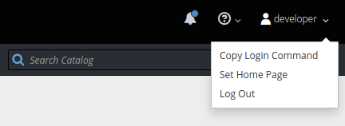

# OpenShift Demo

An OpenShift deployment demo using Spring's Pet Clinic sample application.

## Deploying This Application

These instructions assume you have the OpenShift Client Tools installed on your host & a running cluster available to you.

If this is not the case, follow these instructions to [install Minishift](https://docs.okd.io/latest/minishift/getting-started/preparing-to-install.html#installing-overview) locally.


### Using the OpenShift CLI

**1. Clone this repository**

```bash
$ git clone https://github.com/stricklerxc/openshift-demo.git
$ cd ./openshift-demo
```

**2. Build & Push the Docker Image to a Repository**

```bash
$ docker build -f Dockerfile -t <repository>/<image-name>:<tag>
$ docker login <repository> -u <username> -p <password>
$ docker push <repository><image-name>:<tag>
```


**3. Login to OpenShift**

```bash
$ oc login <cluster-url> -u <username> -p <password>
```

If your organization uses SSO for the OpenShift cluster and you don't know your credentials, you can use the `Copy Login Command` by clicking on your username in the top right of the OpenShift UI.



**4. Create a new Project (or use an existing project)**

```bash
$ oc new-project <project-name> --display-name <display-name> --description <description>
```

Or, to use an existing project:

```bash
$ oc project <existing-project-name>
```

**5. Upload the [openshift-dev.yml](./openshift-dev.yml) template to the OpenShift Cluster**

```bash
$ oc create template -f ./openshift-dev.yml
```

**6. _(Optional)_ Create Docker Registry Secret & Link to Service Account**
_Only needed if pulling images from a private Docker Registry_

```bash
$ oc create secret docker-registry <secret-name> --docker-username "<registry-username>" --docker-password "<registry-password"
$ oc secrets link default <secret-name> --for=pull
```

**7. Use the Template to Create your Application Objects**

```bash
$ oc process -f ./openshift-dev.yml --param-file=./openshift-dev.properties | oc create -f -
```

*Assuming there are no issues with the template, your application objects should begin deploying into your current project*

If for some reason one or more objects did not create, then correct the template and redeploy using the following commands:

```bash
$ oc apply -f ./openshift-dev.yml
$ oc process -f <template-name> | oc apply -f -
```
